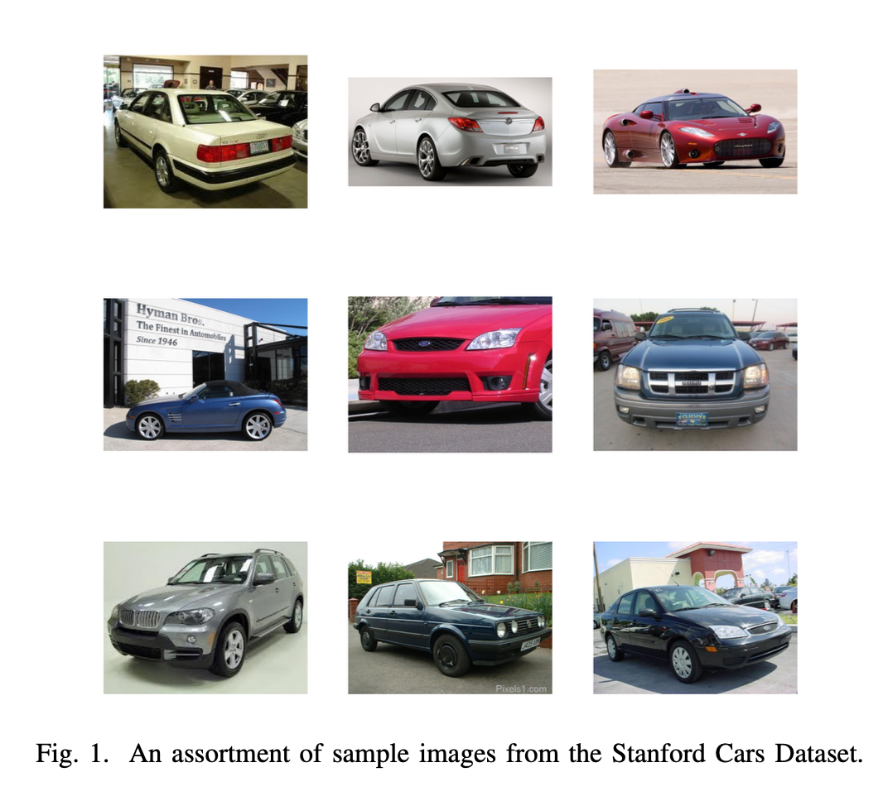

# vehicle-classification
A group project developed for UConn's graduate Big Data Analytics course, CSE 5717. 

## Project overview
Given a picture of a vehicle, the classification model developed in this project is able to predict its make and model with high accuracy and precision.

The input to the model is a clear image of a vehicle and the coordinates of the vehicle's bounding box within the image, and the output is the vehicle's year, make, and model.

The primary metric for evaluating the model's performance was to calculate the percentage of accurate classifications on an unseen testing set of images. The team also considered the relative proximity of the model's predictions for each class by evaluating precision, recall, and F1 score.

## The dataset
The Stanford Cars Dataset, containing 16,185 images of 196 classes of vehicles was selected for this project. Sourced from Jonathan Krause (Stanford, PhD) in his [online archive](https://ai.stanford.edu/~jkrause/cars/car_dataset.html) (deprecated), the dataset can be divided into two major components: the images and the annotations.

Incomplete versions of the dataset can be found at other sources, both [images](https://www.kaggle.com/datasets/jessicali9530/stanford-cars-dataset) and [annotations](https://www.kaggle.com/datasets/meaninglesslives/cars-devkit). The original dataset can, however, still be accessed using the Wayback Machine.

### Images
The images of the dataset are small JPGs with slight deviations in size, most closely cropped to their subjects. Few images were of relatively lower quality than the rest, but none were poor enough to warrant removal.

### Annotations
The annotations portion of the dataset contains all metadata about the images, divided into two types of matrices: a smaller matrix to associate each car class name (an integer between 1 and 196) with its correct make and model, and a larger matrix to connect each image’s file name with its bounding box coordinates and class number.

## Data preparation
Since there were no instances of missing or incomplete data within either the images or annotations portions of the dataset, the group did not need to take any steps for repair. The only text attributes within the matrices belonged to the feature denoting the class label names, which was replaced by the numeric (categorical) and equivalent attribute of class name (denoted by a number 1 through 196). A more thorough explanation of the model’s handling of categorical attributes is below.

### Dividing the dataset
Although the dataset was already split into train and test sets, the team generated a new random split for the subsets to ensure that the instances were divided randomly and in accordance to the expected ratio (80% of the instances would be used for training, and the remaining 20% for testing or evaluation).

### Cropping the images
Since there was an array of images within the dataset which were not quite as closely cropped as they could have been, the team wrote a script to crop the images according to their specified bounding boxes. This assisted the model such that it would receive less extraneous information and thus less noise during training and validation.

### Resizing the images
In order to better prepare the images for integration into the model, they were regularized such that the sizing was consistent amongst all instances. Note that square resolutions are ideal here, since convolutional neural networks train best on square images.

### Random eraser
A portion of each image was randomly obscured with a rectangle of a random size, aspect ratio, and color to add a source of randomization to the training set, allowing for a greater variety of training data and less chance of overfitting.

### Data augmentation
To further reduce the risk of overfitting and to improve model generalization, the dataset's image diversity was artificially inflated for better performance on the validation and test sets. The images experienced a random horizontal flip (since photos may be taken of a vehicle from either side), random rotation of 0.1 (since photos may not be perfectly level, but they will not typically be taken upside down or at very steep angles), and random zoom at 0.2 (as images may not encapsulate the vehicle perfectly).

## Model and technique selection 

### Initial models and techniques
The technique previously leveraged for developing the model for this project was to utilize feature extraction along- side data augmentation with a pre-trained model. Using the Keras library, the team instantiated the VGG16 convolutional base using imagenet. After extracting the VGG16 features and corresponding labels, the team added some extra layers to the model to ensure that the images were augmented and preprocessed (using Keras’ built in image preprocessing method) and to polish the model (to add a dense layer using softmax, for instance). The model was trained with 50 epochs and approximately 300 instances per batch.

This technique was selected over others since similar models have been selected for similar datasets that the team had found. VGG16 was the chosen CNN method since it supports processing large-scale datasets with deeper network layers and smaller filters; while the project’s dataset may be considered rather small for the number of classes it contains, its overall size makes training and compiling it (especially in a timely manner) significantly more difficult. Selecting a pre-trained model is generally a better choice for projects like this, as it results in less difficulties and complications for the team during the process.
There were other similar models that the team had worked with and scrapped, as their projected accuracies or their efficiencies were much too low to consider an option for the classification task.

### The selected model, before fine tuning

After working with the VGG16 model amongst others, the team had very little luck receiving good results during prelim- inary evaluations until incorporating Xception. Developed by Google, the model makes two minor differences in compar- ison to original depthwise separable convolutions: a slightly modified order of operations (performing 1x1 convolutions first, before channel-wise spatial convolution) and the lack of intermediate ReLU non-linearity. For incorporating Xception into the project, the team selected a pre-loaded model with the same justifications as selecting the pre-loaded VGG16 model above: for efficiency and to reduce the risk of complications during the process. Using imagenet for weights, the model included an array of additional layers in order to ensure regularized, non-overfit results and included multiple different kernel initializers and activation functions to extract the right types of information from the data.

## Model evaluation

### Evaluating the initial models

The team developed a regularized convnet with a rescaling layer to limit pixel intensities between 0 and 1, convolution layers to compress 9 pixels into 1 using a ReLU activation function, and an increasing number of filters from 32 to 256. Max pooling layers were used for feature extraction and di- mensionality reduction, and layers were flattened. The softmax activation was used to convert vectors into a probability dis- tribution. Despite the model showing promise during training with a higher validation accuracy than previous models, it didn’t show enough improvement to proceed, as the validation didn’t improve significantly even though the training loss decreased over time.

The team then utilized the VGG16 model, a pre-trained model on the ImageNet dataset, for feature extraction. For the specific task at hand, the team used a technique called “Fast Feature Extraction without Data Augmentation”. The model was configured to exclude the top layers, which are fully connected layers, and to accept input images of shape 224x224x3. The total parameters of this model were ap- proximately 14.7 million, all of which were trainable. For fast feature extraction without data augmentation, the team designed a new model. The input to this model was of shape 7x7x512, which is the output shape of the VGG16 model. The team used Global Average Pooling to convert the 3D outputs to 1D vectors. Then, they flattened the output and connected it to a dense layer with 256 neurons. A dropout layer was added for regularization, followed by the final output layer with 196 neurons (one for each class) using the softmax activation function. The model was compiled with the loss function set to sparse_categorical_crossentropy, the optimizer set to rmsprop, and the metrics set to accuracy. The sparse_categorical_crossentropy loss function is used when the classes are mutually exclusive, i.e., each sample belongs to exactly one class. The rmsprop optimizer helps to adjust the learning rate dynamically, making it a good choice for many machine learning models. The accuracy metric is used to measure the model’s performance.

During training, the model was set to save the best weights based on validation loss. The model was trained for 50 epochs. At the end of training, the model achieved a training accuracy of 97.02% and a validation accuracy of 66.02%. The training loss was 4.8667, while the validation loss was significantly higher at 115.5264. This discrepancy between training and validation metrics suggests that the model might be overfitting on the training data, and therefore, might not generalize well to unseen data.

To address this, the team utilized “feature extraction with data augmentations” where they created an input layer for images of size 224x224x3, applied data augmentation to the inputs, and preprocessed the images using VGG16’s prepro- cessing function. The preprocessed images were then passed through the VGG16 base. A dense layer with 960 units and ReLU activation was added, followed by batch normalization to standardize the inputs to the next layer, and a dropout layer to reduce overfitting. This sequence was repeated once more. Finally, a dense layer with 196 units and softmax activation was added to output probabilities for each of the 196 classes. The model was compiled with sparse categorical cross-entropy loss, RMSprop optimizer, and accuracy as the metric. During training, the model checkpoint with the best validation loss was saved, and training was stopped if there was no improve- ment in validation loss for 10 epochs. The model achieved a training accuracy of 93.71% and a validation accuracy of 81.74% at epoch 17.

The model was fine-tuned by unfreezing the last four layers of the VGG16 base and retraining it with the rest of the model. It was trained for 100 epochs, but training stopped at epoch 11 due to early stopping. At this point, the model had a training accuracy of 95.24% and a validation accuracy of 84.83%. The model was then evaluated on the test dataset. The first model, trained with feature extraction and data augmentation, achieved a test accuracy of 82.6%. The second model, additionally fine-tuned, achieved a slightly higher test accuracy of 84.2%. This shows that fine-tuning improved the model’s performance on unseen data.

### Evaluating the selected model
Further to get some better accuracy, the team built a model using Xception architecture. The model was trained using data augmentation to increase the diversity of the training data and improve the model’s ability to generalize. The model was trained using K-Fold cross-validation, which splits the dataset into ‘K’ subsets and trains the model ‘K’ times, each time using a different subset as the validation set.

In the first fold of the cross-validation, the model was trained for 50 epochs, and the model performed significantly better, with a high validation accuracy of approximately 99.50% and a low validation loss of approximately 0.0150. The model was then used to make predictions on the test data. The model performed well in predicting the classes of the test images, achieving an average accuracy of approximately 94.60%.

## Error analysis
The first model, which utilized VGG16 with Fast Feature Extraction without Data Augmentation, achieved a high training accuracy of 97.02%, but the validation accuracy was significantly lower at 66.02%. This discrepancy, along with the validation loss being much higher than the training loss, indicated overfitting, suggesting that the model may not generalize well to unseen data.

To address this, the team utilized feature extraction with data augmentations in the second model. This improved the model’s performance, with the training accuracy at 93.71% and the validation accuracy at 81.74%. However, the model still showed signs of overfitting, as the training accuracy was higher than the validation accuracy.

In the third model, fine-tuning the VGG16 further improved its performance. The gap between training and validation accuracy decreased, suggesting reduced overfitting. The training accuracy was 95.24% and the validation accuracy was 84.83%. 

The fourth model, which used the Xception architecture with K-Fold Cross-Validation, demonstrated the best perfor- mance. It achieved significantly higher validation accuracy compared to previous models and performed well in predicting the classes of the test images, achieving an average accuracy of approximately 94.60%.

While the initial models showed signs of overfitting, the performance improved with the use of data augmentation and fine-tuning. The Xception model, trained with K-Fold cross- validation, demonstrated the best performance, achieving a high validation accuracy and performing well on the test dataset. This analysis suggests that the choice of architecture, the use of data augmentation, and fine-tuning are critical factors in improving model performance.

## Methods for model improvement

### Early stopping
In order to reduce overfitting, early stopping was introduced to halt training once model performance stops improving on the validation dataset.

### Modifying the number of epochs
In attempt to further reduce overfitting, the number of epochs used in the model was increased from 50 to 30. The team found that this, incorporating a larger number of in- stances per batch (approximately 400) resulted in significantly better results than previous.

### Adding custom layers
In addition to the layers provided by the pre-trained VGG16 model, the team incorporated a few additional layers specific to this dataset for better performance. The added layers included drop outs to eliminate some neurons during training and limit overfitting, new dense layers with ReLU activation and He normal kernel initializer, and global average pooling to extract features and reduce dimensionality.

### Adding optimizers
The team found that the inclusion of the Nadam optimiza- tion function helped to reduce the overall loss and improve the accuracy throughout training and validation.

## Model evaluation
Note that charts and images relevant to model evaluation can be found in the final report document in /documents.

The team tracked a variety of important metrics in order to evaluate the success of the final model, including model accuracy, loss, F1 score, and learning rate. The model trained for 43 epochs before stopping. Over the course of its training, the model saw very good accuracy scores with a greater number of epochs.

The loss became incredibly low for both training and validation after around 10 epochs, with validation loss always remaining just lower than training. The F1 score also became very high after around 10 or 15 epochs, indicating a high harmonic mean of precision and recall for the model. Overall, the model performed very well against the test set, especially considering the large number of classes it contains with few instances per class.

